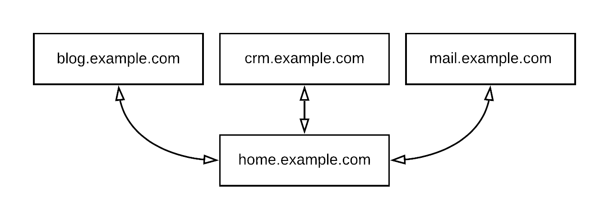

# Weavver Home
Software designed by Weavver, Inc.  
Author: Mitchel Constantin  
License: MIT  
Description: This software is designed to provide a good authentication system.  
Problem:  
1. Each application needs it's own authentication database.  
2. Maintenance of user systems across apps is redundant.  
Solution: Home generates a JWT token to authenticate each user.  
  
Software Stack: Angular, AWS Lambda, AWS API Gateway, AWS S3  

## Installation

#### Environment Requirements:  
1. mongodb (use [atlas.mongodb.com](https://www.mongodb.com/cloud/atlas) as an easy database host)
2. AWS account
3. AWS CLI tools set up in your shell

#### Configure
1. Git clone this repo.
2. Copy .env.example to .env and fill in variables.
3. Set up a domain in Route 53 (example.com).
4. Set up a SSL certificate in us-east-1 (must be in us-east-1) for these names: home.example.com and api.home.example.com.
5. Set up a public bucket in S3 "example-home".
6. Set up a CloudFront distribution to serve that S3 bucket (example-home) from "home.example.com".

##### Deploy API
1. npm install dotenv -g
2. npm install serverless -g
3. cd api 
4. dotenv -e ../.env serverless deploy

##### Deploy Website
Warning: Command #4 will delete ALL FILES from which bucket is specified.

1. npm install dotenv -g
2. npm install serverless -g
3. cd website 
4. aws s3 sync website/dist s3://$AWS_S3_BUCKET --delete --acl public-read
5. aws cloudfront create-invalidation --distribution-id $AWS_CLOUDFRONT_ID --paths "/*"

##### Troubleshooting

Check .gitlab-ci.yml file in this repository for our most up to date deployment example.